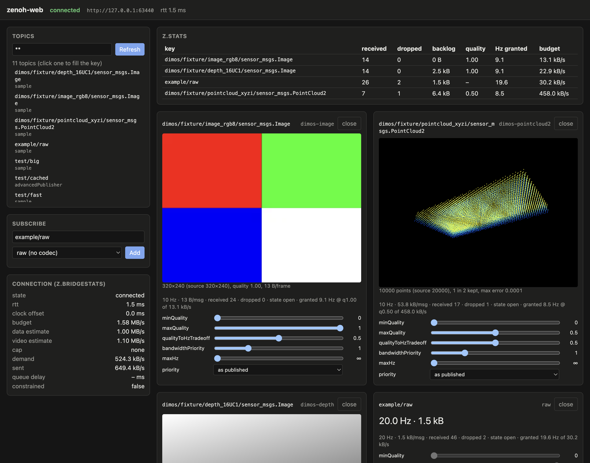

# zenoh-web-cli

The `zenoh-web` command: a [zenoh-web](https://github.com/jeff-hykin/zenoh-web) server with the ROS 2
/ dimos codecs of [zenoh-dimos-codecs](https://github.com/jeff-hykin/zenoh-dimos-codecs). View and
drive a zenoh system from a browser over WebRTC: camera images as H.264 video (hardware-encoded where it can), lossless depth,
quantized point clouds, raw bytes for everything else, and a per-browser bandwidth allocator. The
client API, the allocator and the wire protocol are documented in zenoh-web's README and SPEC.md.



## Install

Prebuilt binaries (Linux x86_64/aarch64 with glibc ≥ 2.35, macOS Apple Silicon/Intel; no Windows):

```sh
curl -fsSL https://raw.githubusercontent.com/jeff-hykin/zenoh-web-cli/main/install.sh | sh
```

It picks the [release](https://github.com/jeff-hykin/zenoh-web-cli/releases) tarball for your OS/CPU,
checks it against `SHA256SUMS`, and installs `zenoh-web` into `~/.local/bin`. Env overrides:
`ZENOH_WEB_VERSION=v0.3.0`, `ZENOH_WEB_INSTALL_DIR=/somewhere/bin`.

With nix (builds from source; aarch64-darwin, aarch64-linux, x86_64-linux):

```sh
nix profile install github:jeff-hykin/zenoh-web-cli   # puts zenoh-web on your PATH
nix run github:jeff-hykin/zenoh-web-cli -- --help     # or run it without installing
```

## Quick start

```sh
git clone https://github.com/jeff-hykin/zenoh-web-cli && cd zenoh-web-cli
cargo run --release -- --serve examples/web --connect tcp/127.0.0.1:7447   # your zenoh router/peer's endpoint
# open http://localhost:7448/
```

No robot handy? Start the test peer first; it publishes zenoh-dimos-codecs' fixtures (a 320×240
image, a 20000-point cloud and a 16-bit depth image, in the dimos message format) while someone
subscribes (`FIXTURES` = that repository's `test/fixtures`):

```sh
cargo run --release --example test_peer -- --listen tcp/127.0.0.1:7447 \
    --publish demo/camera/sensor_msgs.Image=$FIXTURES/dimos/image_rgb8.bin@10 \
    --publish demo/lidar/sensor_msgs.PointCloud2=$FIXTURES/dimos/pointcloud_xyzi.bin@10 \
    --publish demo/depth/sensor_msgs.Image=$FIXTURES/dimos/depth_16UC1.bin@10
```

Then on the page type a key (e.g. `demo/camera/sensor_msgs.Image`; the codec select guesses
`dimos-image`) and press Add. A recent stable Rust (edition 2024), or `nix develop` for a shell with
Rust, deno, zig and cargo-zigbuild.

The example page (`examples/web/`, plain JS, no build step) imports zenoh-web's client from esm.sh at
a pinned commit, so the browser needs internet. Depth and point clouds arrive as zenoh-web fields that
the client decodes itself (`msg.decoded`), zstd-compressed by default; the codec list and which codecs
are video come from the server (`client.codecs`). Query parameters: `?bridge=<url>` (default: the
page's origin) and `?client=<module url>` (e.g. `/client/zenoh_web.js` from `deno task build`, to work
offline).

## Flags

| flag | default | |
|---|---|---|
| `--port <n>` | 7448 | HTTP port: `POST /offer` signaling and static files |
| `--zenoh-config <file>` | zenoh defaults (peer, multicast scouting) | zenoh json5 config, including `access_control` |
| `--connect <endpoint>` | | zenoh endpoint, e.g. `tcp/192.168.1.2:7447`; repeatable |
| `--serve <dir>` | | serve a directory (`/` → `index.html`), live-editable on disk |
| `--max-bandwidth-bytes-per-sec <n>` | none | cap every browser's budget below its estimate (known-slow link, tests) |
| `--bandwidth-target-fraction <f>` | 0.75 | share of the estimate the allocator hands out; the rest is headroom that keeps queues short |
| `--auth-file <file>` | none (anyone may do anything) | require a token: json5 map of tokens to grants, see [Auth](#auth) |
| `--ice-server <url>` | none | STUN/TURN for both ends, e.g. `stun:stun.l.google.com:19302`, `turn:user:pass@relay.example:3478`; repeatable |
| `--turn-secret <secret>` | none | coturn's `static-auth-secret`: TURN servers without `user:pass@` get credentials minted per connection (valid 24 h) |
| `--udp-ports <port or low-high>` | ephemeral | WebRTC UDP port range, one port per browser connection (firewall-friendly) |
| `--video-encoder <name>` | auto | `auto` (the first hardware encoder that encodes a test frame, else software), `software` (openh264), `videotoolbox` (macOS), `gstreamer` (`nvv4l2h264enc` on a Jetson, `nvh264enc`, `vah264enc` / `vaapih264enc`; GStreamer is loaded at runtime, so the binary runs without it); from [zenoh-web-encoders](https://github.com/jeff-hykin/zenoh-web-encoders). A hardware encoder that fails mid-stream hands over to software |
| `--zenoh-signalling <name>` | none | also answer signalling over zenoh as `<name>` (queryables `zenoh-web/<name>/offer`, `/ice`), for a [zenoh-web-relay](https://github.com/jeff-hykin/zenoh-web-relay) this bridge's zenoh dials out to; see [Behind a relay](#behind-a-relay) |
| `--no-http` | off | no HTTP listener at all (needs `--zenoh-signalling`): nothing listens for inbound connections |

Logging: `RUST_LOG=info,zenoh=warn`. Access control is zenoh's own: an `access_control` section in
`--zenoh-config` applies to the browsers' traffic like to any other (denied puts and subscriptions
are dropped silently), e.g. so no browser can drive the robot:

```json5
{
    mode: "peer",
    connect: { endpoints: ["tcp/192.168.1.2:7447"] },
    access_control: {
        enabled: true,
        default_permission: "allow",
        rules: [
            { id: "no-browser-cmd-vel", messages: ["put"], flows: ["egress", "ingress"], permission: "deny", key_exprs: ["**/cmd_vel/**"] },
        ],
        subjects: [{ id: "anyone" }],
        policies: [{ rules: ["no-browser-cmd-vel"], subjects: ["anyone"] }],
    },
}
```

## Auth

`--auth-file tokens.json5` makes every browser present a token (`connect(url, { token })`, sent as
`Authorization: Bearer`). The file maps tokens to a role or a full zenoh-web `Grant`, and may define
lease groups:

```json5
{
    tokens: {
        "viewer-7f3a": "read",    // subscribe, get and listTopics on everything
        "ops-91bc": "write",      // read + publish everything
        "driver-c04d": "lease",   // write + lease any group
        "safety-55e1": { subscribe: ["**"], publish: ["robot/**"], leaseGroups: ["*"], forceExpire: true, maxLeaseSecs: 600 },
        "arm-cam": { subscribe: ["robot/arm/camera/**"], listTopics: ["robot/arm/**"] },
    },
    leaseGroups: { drive: ["robot/cmd_vel/**"], arm: ["robot/arm/cmd/**"] },
}
```

The file is re-read when it changes: removing (or changing) a token revokes it, closing its live
connections and refusing its reconnects. Lease groups are read at startup. Leases bind only the
browsers of this bridge, not native zenoh publishers (zenoh's `access_control` covers those). Grants,
leases and ICE: zenoh-web's README and SPEC ("Auth", "Leases", "ICE and TURN").

A relay with coturn: `turnserver --use-auth-secret --static-auth-secret=$SECRET --realm=robots`, then
`zenoh-web --ice-server turn:relay.example.org:3478 --turn-secret $SECRET --udp-ports 50000-50100`;
the bridge and every browser use the relay with credentials minted per connection.

## Behind a relay

A robot with no inbound ports dials out to a [zenoh-web-relay](https://github.com/jeff-hykin/zenoh-web-relay) on a
public host, which pulls each camera once and fans it out to the browsers:

```sh
zenoh-web --zenoh-config robot.json5 --connect tls/relay.example.com:7447 \
    --zenoh-signalling robot --no-http --auth-file relay-token.json5
```

The relay (`zenoh-web-relay --backend-name robot --backend-token <token> ...`) signals over that zenoh link; the
token file holds the relay's token (its grant bounds every viewer of the relay). `robot.json5` carries the TLS CA and
zenoh user/password for the relay's router; the WebRTC media then flows from the robot to the relay's address.
`tests/zenoh_signalling.rs` runs this command with `--no-http` and connects to it the relay's way.

## Building with nix

```sh
nix build .#zenoh-web --max-jobs auto                  # native (default package); result/bin/zenoh-web
nix build .#zenoh-web-aarch64-linux --max-jobs auto    # on a Mac: aarch64 Linux binary (Jetson, Pi 5)
nix build .#zenoh-web-x86_64-linux --max-jobs auto     # on a Mac: x86_64 Linux binary
nix build .#zenoh-web-x86_64-darwin                    # on an Apple Silicon Mac: Intel macOS binary
nix develop                                            # Rust (+ Linux targets), crate2nix, deno
```

- Built with zenoh-web's `lib.crossRust` ([crate2nix](https://github.com/nix-community/crate2nix)): every crate is its
  own derivation, shared with the zenoh-web, codecs, encoders and relay flakes (one build of zenoh, webrtc, tokio, ...
  for all of them). `--max-jobs auto` lets nix build crates in parallel.
- The Linux builds are cross compiled with zig as the C compiler and linker (openh264, zstd, ring) against glibc 2.35
  (Ubuntu 22.04, Jetson L4T 36, Pi OS bookworm): no VM, no GCC cross toolchain. GStreamer (the Jetson's hardware
  encoder) is opened at runtime, so nothing links it.
- The macOS binary links `/usr/lib/libiconv.2.dylib` (rewritten from nix's copy), so it runs on Macs without nix.
  The Intel one is a plain cargo build by the same clang/SDK with `--target x86_64-apple-darwin` (nixpkgs no longer
  has x86_64-darwin, so it can't go through crate2nix).
- After changing `Cargo.lock`, regenerate `Cargo.nix`: `nix run github:jeff-hykin/zenoh-web#crate2nix -- generate`.

## Releases

All four release binaries are built on an Apple Silicon Mac, with no remote builders:

```sh
nix build .#release --builders ''   # result/<target-triple>/zenoh-web for
                                    # aarch64-apple-darwin, x86_64-apple-darwin,
                                    # aarch64-unknown-linux-gnu, x86_64-unknown-linux-gnu
gh release create v<version> result/dist/*  # the tarballs + SHA256SUMS
```

`result/dist/` holds `zenoh-web-<version>-<target-triple>.tar.gz` (binary + README.md) and
`SHA256SUMS`, made by GNU tar inside the build (no macOS extended attributes, fixed owner and
mtime); `install.sh` reads those names.

## Tests

```sh
cargo test && cargo clippy --all-targets   # the command and the test programs
deno task e2e                              # every end-to-end suite (several minutes)
```

The suites build zenoh-web and zenoh-dimos-codecs at the commits `Cargo.lock` pins (their checkouts
come from `cargo metadata`: the browser client is bundled from them and the fixtures read from the
codecs'). To test local changes, point cargo at your clones, e.g.
`cargo update` after adding to `.cargo/config.toml`:

```toml
[patch."https://github.com/jeff-hykin/zenoh-web"]
zenoh-web = { path = "../zenoh-web/bridge" }
[patch."https://github.com/jeff-hykin/zenoh-dimos-codecs"]
zenoh-dimos-codecs = { path = "../zenoh-dimos-codecs" }
```

Each suite starts a real zenoh test peer (`examples/test_peer.rs`), the server, and its own headless
Chrome (never the one on port 9222):

- `test/e2e.js`: pipe, delivery modes, option rejection, clock sync, deadman, zenoh access control,
  chunked messages, `compress` on a raw topic (zstd byte-exact in fewer bytes, `"none"`), topic listing.
- `test/codecs.js`: every fixture through each codec: depth values exact at full and half resolution
  (zstd by default and with `compress: "none"`, which sends more bytes),
  point clouds within the documented quantization bound (intensity exact), video by its quadrant
  colors within ±10 of the pattern (H.264 is lossy), plus unknown-codec and video-zstd rejections and encodes shared
  across frontends.
- `test/custom_codec.js`: `examples/custom_codec.rs` (zenoh-web with its own zenoh session and four
  codecs of its own): a data codec's text exact through a `registerCodec` decoder (full and half
  quality); a video codec's I420 frames by their color within ±20, once through the bridge's H.264
  and once through the application's own AV1 encoder (rav1e, a `VideoEncoder` as a hardware one would
  be), checking Chrome's negotiated codec; an audio codec's 400 Hz tone, Opus on an audio track, found
  by a WebAudio analyser; unknown names rejected.
- `test/allocation.js`: streams shrinking by `bandwidthPriority` (equal, a higher priority keeping more, priority 0 first) and the
  quality/Hz tradeoff under `--max-bandwidth-bytes-per-sec`.
- `test/abandoned.js`: a viewer whose browser freezes without closing anything: the bridge drops it and
  goes idle.
- `test/latency.js`: a strict-priority stream's p99 under bulk load through a userspace UDP shaper.
- `test/throughput.js` (`deno task e2e:throughput`): one data channel's delivered rate through the shaper
  with delay jitter (`test/shaped_link.js`): at least 2 Mb/s on a ~50 ms ± 20 ms link, and reported
  for a Wi-Fi-like link (RTT 10-430 ms) and a spiky, lossy one.
- `test/video_latency.js` (`deno task e2e:video-latency`): publish -> arrival -> shown for H.264,
  frames identified by a send-time stamp the test peer draws into the pixels;
  H.264 must be shown within 10 ms of arriving (zero playout delay). `--profile jitter50|wifi` shapes it.
- `test/auth.js` (`deno task e2e:auth`): `--auth-file` tokens (no token and unknown tokens refused,
  read-only can subscribe but not publish, narrower grants for subscribe/get/listTopics), revoking by
  editing the file, leases (another client's puts dropped with a reason, released when the holder's
  heartbeat stops, at maxSeconds, force-expire only with the right), and `--ice-server`/`--udp-ports`
  reaching both ends. With coturn's `turnserver` on PATH (or `TURNSERVER=<path>`; nixpkgs marks it
  broken on darwin, `NIXPKGS_ALLOW_BROKEN=1 nix build --impure nixpkgs#coturn` builds it) it also
  runs a relay-only connection through a local coturn with `--turn-secret` credentials.
- `test/example.js` (`deno task e2e:example`): the example page served by `--serve examples/web`, driven
  through its form; checks decoded video frames, drawn points and depth, the raw rate, a control
  re-subscribing, no console errors, and writes `test/artifacts/example.png`. **Needs internet**
  (esm.sh, at the commits `examples/web/app.js` pins).
